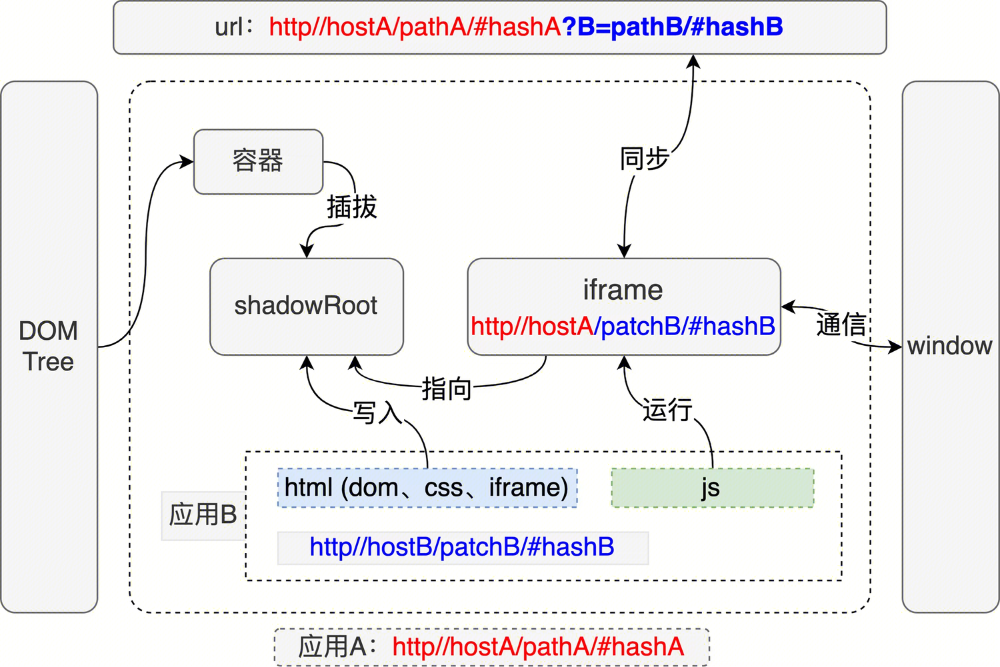

# 无界微前端：如何简单实现 JavaScript 和 CSS 的隔离

面对将要接入三方网站的方案选型上，调研了目前已有微前端的框架，最终选择了无界；无界的思想也非常牛，接入无界后，需要对无界这个微前端框架也需要更加了解。本文主要介绍无界的源码剖析及mini-wujie实现。

## 微前端

Techniques, strategies and recipes for building a **modern web app** with **multiple teams** that can **ship features independently**. -- [Micro Frontends](https://micro-frontends.org/)

微前端是一种多个团队通过独立发布功能的方式来共同构建现代化 web 应用的技术手段及方法策略。

### 微前端优势

[qiankun介绍](https://qiankun.umijs.org/zh/guide) → 微前端架构具备以下几个核心价值：

- 技术栈无关
    
    主框架不限制接入应用的技术栈，微应用具备完全自主权
    
- 独立开发、独立部署
    
    微应用仓库独立，前后端可独立开发，部署完成后主框架自动完成同步更新
    
- 增量升级
    
    在面对各种复杂场景时，我们通常很难对一个已经存在的系统做全量的技术栈升级或重构，而微前端是一种非常好的实施渐进式重构的手段和策略
    
- 独立运行时
    
    每个微应用之间状态隔离，运行时状态不共享
    

微前端架构旨在解决单体应用在一个相对长的时间跨度下，由于参与的人员、团队的增多、变迁，从一个普通应用演变成一个巨石应用([Frontend Monolith](https://www.youtube.com/watch?v=pU1gXA0rfwc))后，随之而来的应用不可维护的问题。这类问题在企业级 Web 应用中尤其常见。

### 使用场景

- 中台项目，集成已有其他网站功能，进行三方网站的集成。；
- 比如有一个巨大的应用，为了降低开发和维护成本，分拆成多个小应用进行开发和部署，然后用一个平台将这些小应用集成起来；
- 目前有两个技术栈不同的网站，现将两个网站进行一个整合；

### 微前端方案

现有微前端方案也出现了很多种，这里简单介绍一下已有微前端方案，对其优缺点可自行查询。

1. [iframe](https://wujie-micro.github.io/doc/guide/#iframe-)
2. [qiankun](https://zhuanlan.zhihu.com/p/414468874) → single-spa + [import-html-entry](https://link.zhihu.com/?target=https%3A//www.npmjs.com/package/import-html-entry)
3. [oppo擎天](https://juejin.cn/post/7143038795816910878) → postMessage+iframe方案
4. [无界](https://wujie-micro.github.io/doc/) → WebComponent + iframe

## 无界微前端

需要接入微前端，主应用与子应用都需要进行改造，下面将介绍主子应用的一个改造指南。

无界特点：

- 采用webConponent + iframe
- JS隔离、CSS隔离
- 子应用保活
- 应用间通信

## 无界源码剖析

### 无界原理可视化

[information.md](https://github.com/Tencent/wujie/blob/master/docs/guide/information.md)中有无界原理图及运行图。

运行时

实例化[WuJie](https://github.com/Tencent/wujie/blob/master/packages/wujie-core/src/index.ts#L260)入口开始，主要做了以下事情：

```
  // 创建沙箱
  const newSandbox = new WuJie({ name, url, attrs, degradeAttrs, fiber, degrade, plugins, lifecycles });
  newSandbox.lifecycles?.beforeLoad?.(newSandbox.iframe.contentWindow);
  // html-entry
  const { template, getExternalScripts, getExternalStyleSheets } = await importHTML({
    url,
    html,
    opts: {
      fetch: fetch || window.fetch,
      plugins: newSandbox.plugins,
      loadError: newSandbox.lifecycles.loadError,
      fiber,
    },
  });
  // 处理cssloader、性能优化 -> 将外部css链接 转为 内联样式
  const processedHtml = await processCssLoader(newSandbox, template, getExternalStyleSheets);
  // 同步路由、准备shadowRoot，将template（含内联样式）渲染到shadowRoot上
  await newSandbox.active({ url, sync, prefix, template: processedHtml, el, props, alive, fetch, replace });
  // iframe插入js 并运行 insertScriptToIframe
  await newSandbox.start(getExternalScripts);
  return newSandbox.destroy;
```

### 无界思想实现



如上图可见，上述主要做了以下事情

1. 需要一个容器
2. 解析url， 解析成html、css、js
3. 将html模版和css放置在shadowRoot中 → 这样实现了css隔离
4. 创建了iframe容器用于存放js代码，js执行代理到shadowRoot中
5. 路由同步 => iframe自身就有自己的路由系统，这里需要将iframe的url同步到window上的url

### 实现效果图：

### 样式隔离：


### js隔离：


### document代理


### mini-wujie实现

根据以下步骤进行实现，其方面命名均采用wujie源码方法，更容易理解。

1. 创建沙箱
2. 创建shadowDOM
3. 将html、css放入shadowDOM
4. 沙箱执行js (proxy document等)